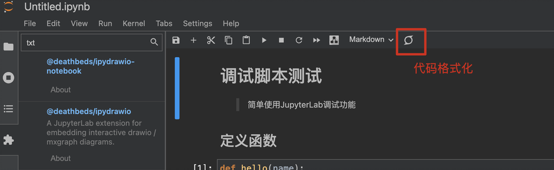

# 安装

```shell
pip install jupyterlab
#  插件
pip jupyterlab_code_formatter jupyterlab-unfold jupyterlab-language-pack-zh-CN
```

## 相关插件

### 1. jupyterlab_code_formatter

用这个插件可以设置保存的时候自动用black和isort进行代码格式化.

```shell
pip install jupyterlab_code_formatter # 安装插件
pip install black isort # 安装格式化工具
```

安装完成后，脚本界面右上角就会有一个格式化按钮，开发者也可以设置保存就触发格式化:


### 2. jupyterlab-unfold

这个插件让JupyterLab的文件浏览具有了和IDE一样的功能，原本JupyterLab在目录间跳转是一级一级进出，有了这个插件可以按照目录树的形式进行操作，极大地提升了打开不同目录下脚本的效率。

```shell
pip install jupyterlab-unfold # 安装插件
```

### 3. 汉化

```shell
pip install jupyterlab-language-pack-zh-CN
```
